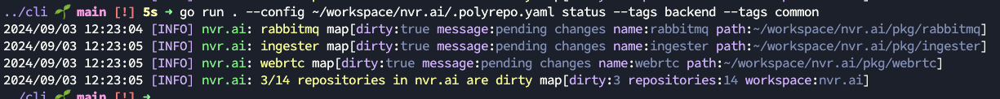

# Polyrepo CLI 🚀

```bash

                 __
    ____  ____  / /_  __________  ____  ____
   / __ \/ __ \/ / / / / ___/ _ \/ __ \/ __ \
  / /_/ / /_/ / / /_/ / /  /  __/ /_/ / /_/ /
 / .___/\____/_/\__, /_/   \___/ .___/\____/
/_/            /____/         /_/
```

> 🤙 **Simplify. Streamline.** <https://polyrepo.pro>

The way we organize our codebases can significantly impact our productivity, collaboration, and overall happiness.

**Polyrepo is a tool for managing polyrepo workspaces like a boss.**

Keep your local and remote repositories in sync, commit and push changes to multiple repositories with a single command, share a single config file with your team, and more.

## 📦 Installation

```bash
go install github.com/polyrepopro/polyrepo@latest
```

## 👉 Getting Started

```bash
polyrepo init
```

This will create a `.polyrepo.yaml` file in your home directory with a default configuration (if you do not pass a path with `-p`).

You can then add your repositories and workspaces to the configuration file.

> Did you know you can have `polyrepo` download the config file from a URL? Just pass the `-u` flag with a URL to a config file!
>
> Try it now: `polyrepo init -u https://raw.githubusercontent.com/polyrepopro/cli/main/.polyrepo.yaml`
>
> This will download the config file from the URL and save it to the path you pass with `-p` or `~/.polyrepo.yaml` if not specified.

### Pulling Changes

Keep your local repositories in sync with the remote repositories by pulling the latest changes automagically with a single command:

```bash
polyrepo pull
```

This will pull the latest changes for all repositories in the workspace configured in the `.polyrepo.yaml` file.

#### Enabling Fast-Forward Merge 🎯

Sometimes when you pull changes into a repository you want the changes to automatically be merged in.

This will prompt you to merge the changes in most cases which will require you to resolve conflicts
manually outside of `polyrepo`.

`polyrepo` allows you to enable fast-forward merges by adding the following to your `.gitconfig`:

```bash
[pull]
  rebase = false
  ff = true # automatic merging on pull
[merge]
  ff = true # allow fast-forward merges to auto-accept
```

### Commiting & Pushing Changes

```bash
polyrepo commit --workspace dev --message "Test commit @ $(date)"
polyrepo push --workspace dev
```

You can also specify a config file and/or name to be explicit:

```bash
polyrepo --config ~/workspace/nvr.ai/.polyrepo.yaml commit --workspace dev --message "Test commit @ $(date)"

2024/09/02 11:39:29 [INFO] workspace.commit: committed map[messages:[{} {}] path:~/workspace/nvr.ai repositories:2 workspace:dev]

polyrepo --config ~/workspace/nvr.ai/.polyrepo.yaml push --workspace dev

2024/09/02 11:40:40 [INFO] workspace.push: pushed changes for all repositories map[path:~/workspace/nvr.ai repositories:2 workspace:dev]
```

## Commands

| Command                                                 | Description                                                   |
| ------------------------------------------------------- | ------------------------------------------------------------- |
| [`polyrepo help`](#polyrepo-help)                       | Show the help for the polyrepo CLI.                           |
| [`polyrepo version`](#polyrepo-version)                 | Show the version of the polyrepo CLI.                         |
| [`polyrepo init`](#polyrepo-init)                       | Initialize a new global `.polyrepo.yaml` configuration file.  |
| [`polyrepo run`](#polyrepo-run)                         | Run a command(s) in each repository and watch for changes.    |
| [`polyrepo status`](#polyrepo-status)                   | Show the status of the polyrepo workspace.                    |
| [`polyrepo sync`](#polyrepo-sync)                       | Sync with the remotes.                                        |
| [`polyrepo switch`](#polyrepo-switch)                   | Switch the branch of repositories in a workspace.             |
| [`polyrepo commit`](#polyrepo-commit)                   | Commit the changes for each repository in the workspace.      |
| [`polyrepo commit-and-push`](#polyrepo-commit-and-push) | Commit the changes for each repository in the and push.       |
| [`polyrepo push`](#polyrepo-push)                       | Push the changes for each repository in the workspace.        |
| [`polyrepo pull`](#polyrepo-pull)                       | Pull the latest changes for each repository in the workspace. |
| [`polyrepo repo add`](#polyrepo-repo-add)               | Add a repository to the polyrepo workspace.                   |
| [`polyrepo repo remove`](#polyrepo-repo-remove)         | Remove a repository from the polyrepo workspace.              |
| [`polyrepo repo sync`](#polyrepo-repo-sync)             | Sync a repo with the remote.                                  |
| [`polyrepo repo track`](#polyrepo-repo-track)           | Adds the current working directory to the polyrepo workspace. |

### `polyrepo help`

Show the help for the polyrepo CLI.

### `polyrepo version`

Show the version of the polyrepo CLI.

### `polyrepo init`

Initialize a new global `.polyrepo.yaml` configuration file.

> This will overwrite the `.polyrepo.yaml` file at the given path if it exists.

| Flag       | Default            | Required | Description                                       |
| ---------- | ------------------ | -------- | ------------------------------------------------- |
| -p, --path | `~/.polyrepo.yaml` | **Yes**  | The path to save the `.polyrepo.yaml` file.       |
| -u, --url  |                    | No       | A URL to download the `.polyrepo.yaml` file from. |

### `polyrepo run`

Run command(s) in each repository in the and watch for changes.

> Use `watch: true` in the runner to watch for changes and automatically restart the command(s) base
> on pattern matchers.

Example configuration with watches:

```yaml
workspaces:
  - name: example
    path: ~/workspace/polyrepo-example
    repositories:
      - url: git@github.com:polyrepopro/example-test-repo.git
        branch: main
        path: examples/example-test-repo
        runners:
          - watch: true
            matchers:
              - include: "go.mod"
              - include: ".go$"
                ignore: "pkg/go-glib"
            commands:
              - name: "run"
                command:
                  - "go"
                  - "run"
                  - "."
```

### `polyrepo status`

Show the status of all polyrepo workspace repositories.

| Flag            | Default | Required | Description                                   |
| --------------- | ------- | -------- | --------------------------------------------- |
| -w, --workspace |         | Optional | The name of the to show the status of or all. |
| -t, --tags      |         | Optional | The tags to filter the repositories by.       |

```bash
go status
```

Example output:



### `polyrepo sync`

Sync with the remotes.

This command syncs the by ensuring that each repository exists locally.

| Flag            | Default | Required | Description              |
| --------------- | ------- | -------- | ------------------------ |
| -w, --workspace |         | **Yes**  | The name of the to sync. |

### `polyrepo switch`

Switch the default workspace.

> ![NOTE]
> This will modify the `.polyrepo.yaml` file by setting the [`default`](#default) workspace value.

| Flag            | Default | Required | Description                               |
| --------------- | ------- | -------- | ----------------------------------------- |
| -w, --workspace |         | **Yes**  | The name of the to switch branch on.      |
| -b, --branch    |         | **Yes**  | The branch to switch the repositories to. |

### `polyrepo checkout`

Checkout a branch across all repositories in a workspace.

| Flag            | Default | Required | Description                                 |
| --------------- | ------- | -------- | ------------------------------------------- |
| -w, --workspace |         |          | The name of the to checkout branch on.      |
| -b, --branch    |         | **Yes**  | The branch to checkout the repositories to. |

### `polyrepo commit`

Commit the changes for each repository in the workspace.

| Flag            | Default | Required | Description                                  |
| --------------- | ------- | -------- | -------------------------------------------- |
| -w, --workspace |         | **Yes**  | The name of the to commit for.               |
| -m, --message   |         | **Yes**  | The message to commit the repositories with. |

### `polyrepo commit-and-push`

Commit the changes for each repository in the and push.

### `polyrepo push`

Push the changes for each repository in the workspace.

### `polyrepo pull`

Pull the latest changes for each repository in the workspace.

### `polyrepo repo add`

Add a repository to the polyrepo workspace.

### `polyrepo repo remove`

Remove a repository from the polyrepo workspace.

### `polyrepo repo sync`

Sync a repo with the remote.

### `polyrepo repo track`

Adds the current working directory to the polyrepo workspace.

## ⚙️ Configuration

Polyrepo workspaces are configured in a `.polyrepo.yaml` file which can be created by running `polyrepo init`.

A simple example `.polyrepo.yaml` file looks like this:

```yaml
workspaces:
  - name: dev
    path: ~/workspace/polyrepo-dev
    repositories:
      - url: git@github.com:polyrepopro/api.git
        branch: main
        path: pkg/api
      - url: git@github.com:polyrepopro/cli.git
        branch: main
        path: pkg/cli
```

A more complex example:

```yaml
default: dev
workspaces:
  - name: dev
    path: ~/workspace/nvr.ai
    repositories:
      - name: mail
        url: git@github.com:nvr-ai/go-mail.git
        branch: main
        path: pkg/mail
      - name: config
        url: git@github.com:nvr-ai/go-config.git
        branch: main
        path: pkg/config
      - name: exceptions
        url: git@github.com:nvr-ai/go-exceptions.git
        branch: main
        path: pkg/exceptions
      - name: types
        url: git@github.com:nvr-ai/go-types.git
        branch: main
        path: pkg/types
      - name: spa
        url: git@github.com:nvr-ai/apps/spa.git
        branch: main
        path: apps/spa
        runners:
          - cwd: apps/spa
            matchers:
              - path: src
                include: ".svelte$|.ts$|.scss$|.pcss$|.json$"
                ignore: "node_modules"
            commands:
              - name: "run"
                command:
                  - "npm"
                  - "run"
                  - "dev"
      - name: broker
        url: git@github.com:nvr-ai/go-broker.git
        branch: main
        path: pkg/broker
        runners:
          - cwd: pkg/broker
            watch: true
            matchers:
              - include: "go.mod"
              - include: ".go$"
            commands:
              - name: "run"
                command:
                  - "go"
                  - "run"
                  - "."
      - name: ingester
        url: git@github.com:nvr-ai/go-ingester.git
        branch: main
        path: pkg/ingester
        runners:
          - cwd: pkg/ingester
            watch: true
            matchers:
              - include: "go.mod"
              - include: ".go$"
            commands:
              - name: "run"
                command:
                  - "go"
                  - "run"
                  - "."
      - name: kubernetes-controller
        url: git@github.com:nvr-ai/go-kubernetes-controller.git
        branch: main
        path: pkg/kubernetes-controller
        runners:
          - cwd: pkg/kubernetes-controller
            watch: true
            matchers:
              - include: "go.mod"
              - include: ".go$"
            commands:
              - name: "run"
                command:
                  - "go"
                  - "run"
                  - "."
      - name: streamer
        url: git@github.com:nvr-ai/go-streamer.git
        branch: main
        path: pkg/go-streamer
        runners:
          - cwd: pkg/go-streamer
            watch: true
            matchers:
              - include: "go.mod"
              - include: ".go$"
                ignore: "pkg/go-glib"
            commands:
              - name: "run"
                command:
                  - "go"
                  - "run"
                  - "."
      - name: webrtc
        url: git@github.com:nvr-ai/go-webrtc.git
        branch: main
        path: pkg/webrtc
        runners:
          - cwd: pkg/webrtc
            watch: true
            matchers:
              - include: "go.mod"
              - include: ".go$"
            commands:
              - name: "run"
                command:
                  - "go"
                  - "run"
                  - "."

```

### Settings

|                                                                                                               | Description                                        |
| ------------------------------------------------------------------------------------------------------------- | -------------------------------------------------- |
| [`default`](#default)                                                                                         | The default workspace name to use.                 |
| [`workspaces[]`](#workspaces)                                                                                 | List of workspaces to use.                         |
| [`workspaces[].repositories[]`](#workspacesrepositories)                                                      | List of repositories to use.                       |
| [`workspaces[].repositories[].name`](#workspacesrepositoriesname)                                             | The name of the repository.                        |
| [`workspaces[].repositories[].url`](#workspacesrepositoriesurl)                                               | The URL of the repository.                         |
| [`workspaces[].repositories[].branch`](#workspacesrepositoriesbranch)                                         | Branch name to sync the repository with.           |
| [`workspaces[].repositories[].origin`](#workspacesrepositoriesorigin)                                         | Origin to sync the repository with.                |
| [`workspaces[].repositories[].path`](#workspacesrepositoriespath)                                             | Path to the repository locally.                    |
| [`workspaces[].repositories[].runners[].cwd`](#workspacesrepositoriesrunnerscwd)                              | The current working directory to watch.            |
| [`workspaces[].repositories[].runners[].watch`](#workspacesrepositoriesrunnerswatch)                          | Whether to watch for changes.                      |
| [`workspaces[].repositories[].runners[].matchers`](#workspacesrepositoriesrunnersmatchers)                    | List of matchers for the runner.                   |
| [`workspaces[].repositories[].runners[].matchers[].include`](#workspacesrepositoriesrunnersmatchersinclude)   | The pattern to include.                            |
| [`workspaces[].repositories[].runners[].matchers[].ignore`](#workspacesrepositoriesrunnersmatchersignore)     | The pattern to ignore.                             |
| [`workspaces[].repositories[].runners[].commands`](#workspacesrepositoriesrunnerscommands)                    | List of commands to run when changes are detected. |
| [`workspaces[].repositories[].runners[].commands[].name`](#workspacesrepositoriesrunnerscommandsname)         | The name of the command.                           |
| [`workspaces[].repositories[].runners[].commands[].command[]`](#workspacesrepositoriesrunnerscommandscommand) | The arguments to execute on the shell with.        |

#### `default`

> `optional`
> This is an optional setting. If it is not set, the default workspace will be the first workspace in the list.

The default workspace name to use.

#### `workspaces[]`

List of workspaces to use.

#### `workspaces[].path`

> `required`
> This is a required setting for each repository.

Path to the workspace (can be relative or absolute).

If a relative path is provided, it will be resolved relative to the `workspaces[].path` value.

Given the following configuration:

```yaml
default: dev
workspaces:
  - name: dev
    path: ~/workspace/awesome-project
    repositories:
      - name: api
        url: git@github.com:awesome-project/api.git
        branch: main
        path: pkg/api
```

The resulting path for the repository will be `~/workspace/awesome-project/pkg/api`.

#### `workspaces[].repositories[].name`

The name of the repository.

#### `workspaces[].repositories[].url`

The URL of the repository.

#### `workspaces[].repositories[].branch`

Branch name to sync the repository with.

#### `workspaces[].repositories[].origin`

Origin to sync the repository with (overrides default).

#### `workspaces[].repositories[].path`

Path to the repository locally.

#### `workspaces[].repositories[].runners[].cwd`

The current working directory to watch.

#### `workspaces[].repositories[].runners[].watch`

Whether to watch for changes.

#### `workspaces[].repositories[].runners[].matchers`

List of matchers for the runner.

#### `workspaces[].repositories[].runners[].matchers[].include`

The pattern to include.

#### `workspaces[].repositories[].runners[].matchers[].ignore`

The pattern to ignore.

#### `workspaces[].repositories[].runners[].commands`

List of commands to run when changes are detected.

#### `workspaces[].repositories[].runners[].commands[].name`

The name of the command.

#### `workspaces[].repositories[].runners[].commands[].command[]`

The arguments to execute on the shell with.

The command is an array of strings that make up the command to run:

```yaml
command:
  - "go"
  - "run"
  - "main.go"
```

#### `workspaces[].repositories[].runners[].commands[].command[]`

The arguments to execute on the shell with.

The command is an array of strings that make up the command to run:

```yaml
command:
  - "go"
  - "run"
  - "main.go"
```

---

Happy multi-repo hacking! ✨
