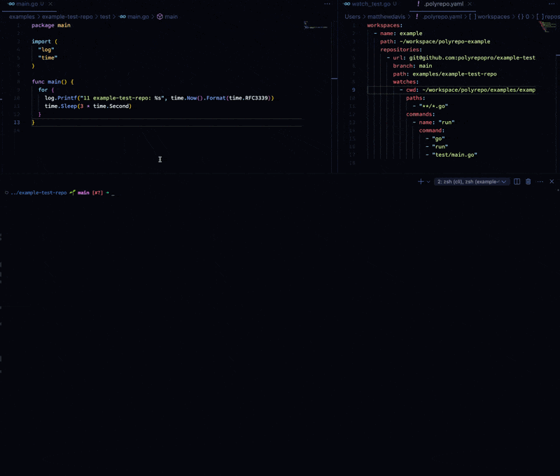

# Polyrepo CLI

> Polyrepo is a tool for managing polyrepo workspaces like a boss.
>
> Keep your local and remote repositories in sync, commit and push changes to multiple repositories with a single command, and more.

Polyrepo CLI is a command-line interface for the Polyrepo project. It allows you to manage your polyrepo workspace and its repositories.

## Installation

```bash
go install github.com/polyrepopro/cli@latest
```

## Getting Started

```bash
polyrepo init
```

### Commiting & Pushing Changes

```bash
polyrepo workspace commit --workspace dev --message "Test commit @ $(date)"
polyrepo workspace push --workspace dev
```

You can also specify a config file and/or workspace name to be explicit:

```bash
polyrepo workspace --config ~/workspace/nvr.ai/.polyrepo.yaml commit --workspace dev --message "Test commit @ $(date)"

2024/09/02 11:39:29 [INFO] workspace.commit: committed map[messages:[{} {}] path:~/workspace/nvr.ai repositories:2 workspace:dev]

polyrepo workspace --config ~/workspace/nvr.ai/.polyrepo.yaml push --workspace dev

2024/09/02 11:40:40 [INFO] workspace.push: pushed changes for all repositories map[path:~/workspace/nvr.ai repositories:2 workspace:dev]
```

## Commands

| Command                                                                   | Description                                                       |
| ------------------------------------------------------------------------- | ----------------------------------------------------------------- |
| [polyrepo help](#polyrepo-help)                                           | Show the help for the polyrepo CLI.                               |
| [polyrepo version](#polyrepo-version)                                     | Show the version of the polyrepo CLI.                             |
| [polyrepo init](#polyrepo-init)                                           | Initialize a new global `.polyrepo.yaml` configuration file.      |
| [polyrepo workspace run](#polyrepo-workspace-run)                         | Run a command(s) in each repository and watch for changes.        |
| [polyrepo workspace status](#polyrepo-workspace-status)                   | Show the status of the polyrepo workspace.                        |
| [polyrepo workspace sync](#polyrepo-workspace-sync)                       | Sync workspace with the remotes.                                  |
| [polyrepo workspace switch](#polyrepo-workspace-switch)                   | Switch the branch of repositories in a workspace.                 |
| [polyrepo workspace commit](#polyrepo-workspace-commit)                   | Commit the changes for each repository in the workspace.          |
| [polyrepo workspace commit-and-push](#polyrepo-workspace-commit-and-push) | Commit the changes for each repository in the workspace and push. |
| [polyrepo workspace push](#polyrepo-workspace-push)                       | Push the changes for each repository in the workspace.            |
| [polyrepo workspace pull](#polyrepo-workspace-pull)                       | Pull the latest changes for each repository in the workspace.     |
| [polyrepo repo add](#polyrepo-repo-add)                                   | Add a repository to the polyrepo workspace.                       |
| [polyrepo repo remove](#polyrepo-repo-remove)                             | Remove a repository from the polyrepo workspace.                  |
| [polyrepo repo sync](#polyrepo-repo-sync)                                 | Sync a repo with the remote.                                      |
| [polyrepo repo track](#polyrepo-repo-track)                               | Adds the current working directory to the polyrepo workspace.     |

### `polyrepo help`

Show the help for the polyrepo CLI.

### `polyrepo version`

Show the version of the polyrepo CLI.

### `polyrepo init`

Initialize a new global `.polyrepo.yaml` configuration file.

> This will overwrite the `.polyrepo.yaml` file at the given path if it exists.

| Flag       | Default            | Required | Description                                       |
| ---------- | ------------------ | -------- | ------------------------------------------------- |
| -p, --path | `~/.polyrepo.yaml` | **Yes**  | The path to save the `.polyrepo.yaml` file.       |
| -u, --url  |                    | No       | A URL to download the `.polyrepo.yaml` file from. |

### `polyrepo workspace run`

Run a command(s) in each repository in the workspace and watch for changes.

If changes are detected, the command(s) are restarted.



Example configuration with watches:

```yaml
workspaces:
  - name: example
    path: ~/workspace/polyrepo-example
    repositories:
      - url: git@github.com:polyrepopro/example-test-repo.git
        branch: main
        path: examples/example-test-repo
        watches:
          - cwd: ~/workspace/polyrepo/examples/example-test-repo
            paths:
              - "**/*.go"
            commands:
              - name: "run"
                command:
                  - "go"
                  - "run"
                  - "test/main.go"
```

### `polyrepo workspace status`

Show the status of the polyrepo workspace.

| Flag            | Default | Required | Description                                                                   |
| --------------- | ------- | -------- | ----------------------------------------------------------------------------- |
| -w, --workspace |         | **Yes**  | The name of the workspace to show status for (will show all if not provided). |

### `polyrepo workspace sync`

Sync workspace with the remotes.

This command syncs the workspace by ensuring that each repository exists locally.

| Flag            | Default | Required | Description                        |
| --------------- | ------- | -------- | ---------------------------------- |
| -w, --workspace |         | **Yes**  | The name of the workspace to sync. |

### `polyrepo workspace switch`

Switch the branch of repositories in a workspace.

| Flag            | Default | Required | Description                                    |
| --------------- | ------- | -------- | ---------------------------------------------- |
| -w, --workspace |         | **Yes**  | The name of the workspace to switch branch on. |
| -b, --branch    |         | **Yes**  | The branch to switch the repositories to.      |

### `polyrepo workspace commit`

Commit the changes for each repository in the workspace.

| Flag            | Default | Required | Description                                  |
| --------------- | ------- | -------- | -------------------------------------------- |
| -w, --workspace |         | **Yes**  | The name of the workspace to commit for.     |
| -m, --message   |         | **Yes**  | The message to commit the repositories with. |

### `polyrepo workspace commit-and-push`

Commit the changes for each repository in the workspace and push.

### `polyrepo workspace push`

Push the changes for each repository in the workspace.

### `polyrepo workspace pull`

Pull the latest changes for each repository in the workspace.

### `polyrepo repo add`

Add a repository to the polyrepo workspace.

### `polyrepo repo remove`

Remove a repository from the polyrepo workspace.

### `polyrepo repo sync`

Sync a repo with the remote.

### `polyrepo repo track`

Adds the current working directory to the polyrepo workspace.

## Configuration

Polyrepo workspaces are configured in a `.polyrepo.yaml` file which can be created by running `polyrepo workspace init`.

A simple example `.polyrepo.yaml` file looks like this:

```yaml
workspaces:
  - name: dev
    path: ~/workspace/polyrepo-dev
    repositories:
      - url: git@github.com:polyrepopro/api.git
        branch: main
        path: pkg/api
      - url: git@github.com:polyrepopro/cli.git
        branch: main
        path: pkg/cli
```

A more complex example:

```yaml
workspaces:
  - name: dev
    path: ~/workspace/polyrepo-dev
    repositories:
      - url: git@github.com:polyrepopro/api.git
        remote: origin
        branch: main
        path: pkg/api
        hooks:
          clone:
            - command:
                - go
                - mod
                - download
          pre_push:
            - command:
                - go
                - mod
                - verify
        watches:
          - paths:
              - "**/*.go"
            commands:
              - name: "run"
                command:
                  - "go"
                  - "run"
                  - "main.go"
      - url: git@github.com:polyrepopro/cli.git
        branch: main
        path: pkg/cli
        hooks:
          clone:
            - command:
                - go
                - mod
                - download
          pull:
            - command:
                - go
                - mod
                - download
          pre_push:
            - command:
                - go
                - mod
                - verify
        watches:
          - paths:
              - "**/*.go"
            commands:
              - name: "run"
                command:
                  - "go"
                  - "run"
                  - "main.go"
```

### Schema

#### Workspace

| Field        | Type                        | Description                                 |
| ------------ | --------------------------- | ------------------------------------------- |
| name         | string                      | The name of the workspace.                  |
| path         | string                      | The path to the workspace.                  |
| repositories | [[]Repository](#repository) | The repositories containedin the workspace. |

#### Repository

| Field   | Type              | Description                                  |
| ------- | ----------------- | -------------------------------------------- |
| url     | string            | The URL of the repository.                   |
| branch  | string            | The branch to sync the repository to.        |
| path    | string            | The path to the repository in the workspace. |
| watches | [[]Watch](#watch) | The watches for the repository.              |

#### Watch

| Field    | Type                  | Description                                    |
| -------- | --------------------- | ---------------------------------------------- |
| cwd      | string                | The current working directory to watch.        |
| paths    | []string              | The paths to watch for changes.                |
| commands | [[]Command](#command) | The commands to run when changes are detected. |

#### Command

The command is an array of strings that make up the command to run:

```yaml
command:
  - "go"
  - "run"
  - "main.go"
```

| Field   | Type     | Description              |
| ------- | -------- | ------------------------ |
| name    | string   | The name of the command. |
| command | []string | The command to run.      |

---

Happy multi-repo hacking! ✨
